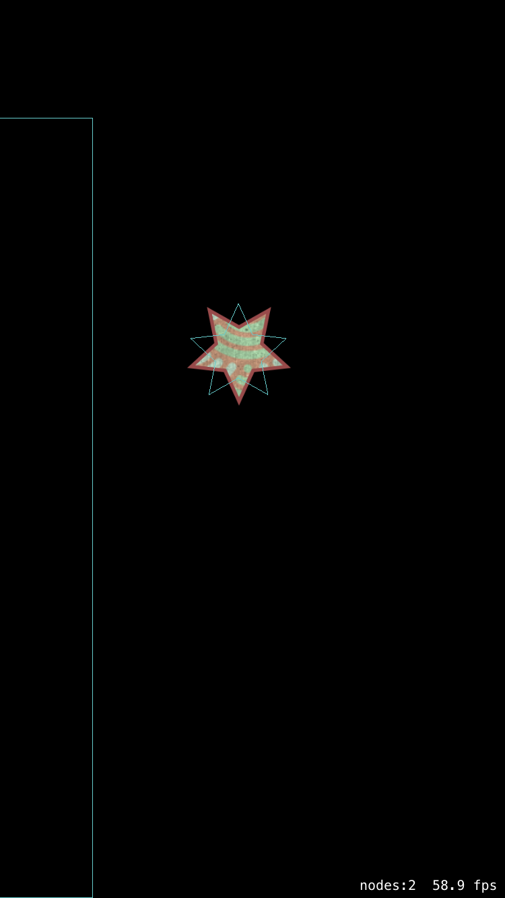

# Shapes-Test

This tests UIBezier shapes used to create filled images and physics bodes. 
There is a problem where the physics body is upside-down compared to the image.

This image shows the fill image, and the physics body as a blue outline. 

